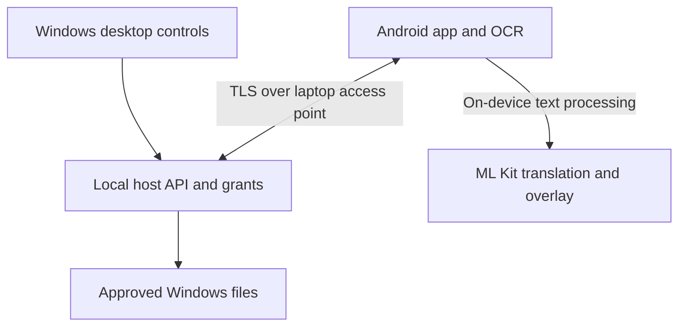

# File Near By

## Engineering handoff: Windows 11 and Android 16

**Revision:** 1.4 - 24 September 2026  
**Agent entry point:** Begin with root `INITIALIZE.md` for documentation-only preparation P000. Do not generate application code during P000. Then read `AGENTS.md`, then the relevant sections of this Markdown specification and `file_near_by_session_playbook.md`. Markdown is authoritative for implementation; previously exported PDFs are human-readable snapshots of older revisions and must not determine the current name or stack.

**Deliverables:** implementation plan, technical architecture, security specification, product behavior, delivery roadmap, and acceptance criteria.  
**Status:** planning baseline. Confirmed requirements are distinguished from proposed engineering choices. Hardware compatibility and the translation service are release gates, not verified product capabilities. No application code or hardware prototype has been produced as part of this report.

### Executive recommendation

Build a native Android application in Kotlin and Jetpack Compose, connected to a Windows desktop application built with C#/.NET 10 LTS, WPF with MVVM, and an embedded ASP.NET Core/Kestrel host. Package Windows as an installer and Android as a signed APK. Docker is unnecessary for this deployment.

The laptop creates a local Wi-Fi access point using the Windows Wi-Fi Direct legacy access-point API. Android joins it as a Wi-Fi client. File browsing, image viewing, and authorized file operations use an authenticated TLS connection directly between devices. They remain usable without internet access. The operating system, wireless adapter, and driver must support the connection mode; an app cannot guarantee hotspot creation on every laptop. [S1, S2]

Use Android ML Kit Text Recognition, Language Identification, and on-device Translation as the preferred no-billing implementation. Translate recognized text locally and draw an independent overlay. No Cloud project, payment card, API key, or per-request paid service is needed for this SDK path. Download selected language models before offline use. First benchmark actual source samples and the owner's phone; if quality or footprint is unsuitable, ship the owner-authorized external Google image translation workflow instead. [S29-S32, S35]

**Revision 1.4 change:** display name File Near By; code identifier FileNearBy. The organized repository has root README.md, INITIALIZE.md, and AGENTS.md; the directory map lives in docs/REPOSITORY_LAYOUT.md. P000 prepares documentation and empty directories only, before the 96 implementation cards. The companion playbook is revision 1.3. The .NET/WPF and Kotlin/Compose baseline is unchanged.

**Feasibility limits:** universal hotspot availability still depends on the adapter. Local translation avoids a hosted request per text, but quality, language coverage, resource use, and unconditional acceptance of all content are not established. Do not promise that any Google model or external service will never suppress or mishandle a translation. These are measured gates, not reasons to add paid services.

## 1. Confirmed requirements and traceability

| ID | Confirmed requirement | Specification / verification |
| --- | --- | --- |
| R01 | Windows only initially; owner's device runs Windows 11 | Sections 4, 17; clean installation test |
| R02 | Android phone runs Android 16; native Android preferred | Sections 4, 12; real-device testing |
| R03 | Laptop-created hotspot preferred; file features work without internet or an existing router | Sections 5, 19; offline hardware gate |
| R04 | Laptop owner controls the permitted filesystem locations | Sections 7, 8; authorization and escape tests |
| R05 | Phone operates only within granted laptop locations | Sections 8, 9; all APIs authorize every object |
| R06 | One phone paired to one laptop initially | Sections 6, 14; second-device enrollment rejected |
| R07 | Future multiple phones or other devices to one laptop | Section 21; per-device grants from the outset |
| R08 | View without saving a permanent phone copy; transfers are explicit | Sections 9, 10; storage inspection |
| R09 | Explicit uploads/downloads and remote move/copy/rename/delete | Sections 9, 15; integrity and failure tests |
| R10 | Built-in image gallery and viewer | Sections 11, 12; gallery acceptance suite |
| R11 | Translation leaves original image unchanged | Section 13; byte hash unchanged after translation |
| R12 | English default; auto source detection with manual override | Section 13; language detection and model-ready offline tests |
| R13 | No required billing/card setup; lightweight local translation now allowed; external Google image translation if unsuitable | Sections 4, 13; clean setup and route gate |
| R14 | No app-imposed adult-content block; avoid provider refusals | Section 3; app behavior feasible, provider guarantee unresolved |
| R15 | Temporary caches must be destroyed/cleared and must not accumulate | Section 10; budget, lifecycle, and crash tests |
| R16 | Encrypted access; having the app or observing traffic is insufficient to read files | Sections 6-8; hostile-client and capture tests |
| R17 | Lightweight, modern, clear Windows UI | Section 12; measured footprint and usability review |
| R18 | Normal Windows installer accepted; Docker optional and unnecessary | Section 17; offline installer acceptance |
| R19 | Cloud is a future direction; no cloud file storage currently requested | Section 21; future architecture only |
| R20 | Agent-readable Markdown handoff; PDF for human reference | Current Markdown takes precedence over older PDF snapshots |

The user has approved temporary in-memory viewing, explicit Upload/Download, and laptop-side operations within granted directories. The latest instruction permits evaluating lightweight local translation and deferring translation to the Google consumer app if unsuitable. An external handoff is an explicit disclosure/copy chosen by the user; ordinary viewing never exports automatically. File hosting requires no account, relay, or hosted backend.

The following are engineering proposals, not additional user facts: framework selection, cache budgets, retry limits, initial image formats, delete recovery policy, supported CPU architectures, schedule, and performance targets. They are identified below so the team can review them without confusing them with confirmed requirements.

## 2. Product boundaries and operating modes

### 2.1 Mode matrix

| Mode | File features | Translation | Status |
| --- | --- | --- | --- |
| Laptop access point; no internet on either device | Browse, view, modify, upload, download | Local translation when required models are present; otherwise Model not downloaded | Primary required mode |
| Laptop access point; phone also has usable mobile internet | Same local file features | Local translation; optional model downloads or external workflow | Test internet coexistence only where needed |
| Laptop access point; an independently reachable internet route exists on phone | Same local file features | Local translation; download models if requested | Detect actual connectivity; do not assume internet sharing |
| Existing Wi-Fi LAN with no internet | Same file protocol, if enabled | Local translation with downloaded models | Optional alternative; does not replace hotspot requirement |
| Devices on different networks | Not in the initial hotspot implementation | Independent of file connectivity | Future design; clarify before adding remote access |

Hotspot transport still depends on radio quality, interference, distance, Wi-Fi band, and storage speed. It avoids dependence on an ISP's download/upload bandwidth for file operations. A powered-off or sleeping laptop cannot serve files, and radio hardware cannot be enabled when physically unavailable.

### 2.2 Proposed first-release feature boundary

Required workflows: connect, pair, select roots, browse, search the current directory, create folder, rename, copy, move, delete, upload, download, gallery, zoom/pan, translation overlay if G2 passes (otherwise external translation action), disconnect, revoke, clear temporary data, and recover interrupted jobs.

Arbitrary file types can be listed and explicitly transferred as opaque bytes. Built-in viewing is an image feature. Proposed mandatory image decoding: JPEG, PNG, WebP, and GIF, including animated GIF/WebP where decoder support passes testing. HEIF/HEIC, AVIF, TIFF, RAW, SVG, archives, PDF reading, and video playback need individual feasibility decisions. Unsupported previews must not prevent file transfer. Do not silently convert the original file.

Proposed exclusions for the first implementation: unattended access before Windows login, automatic synchronization, automatic uploads, remote shell, arbitrary program execution, archive extraction, background indexing of entire drives, cloud file storage, and Bluetooth transport. These are scope recommendations, not claims that the owner has rejected them. Any needed addition changes the estimate.

## 3. Decision register and feasibility gates

| Gate | What must be established | Owner / output |
| --- | --- | --- |
| G1: offline hotspot | Actual laptop Wi-Fi adapter, driver, Windows build, CPU architecture; access point starts with upstream Wi-Fi disconnected and Ethernet unplugged | Windows engineer; hardware capability report and demo |
| G2: translation route | No-billing clean setup; local quality, footprint, offline models, SDK privacy; external workflow if local route is unsuitable | Android engineer + owner; measured local-or-external disposition |
| G3: OCR coverage | Representative images and required scripts; automatic detection cannot guarantee recognition of every language | Owner supplies examples; Android engineer produces measured results |
| G4: security-critical filesystem | Handle-based containment, races, reparse points, and broad-drive grants behave correctly on supported filesystems | Windows engineer + security reviewer; adversarial test evidence |
| G5: proposed product defaults | Cache budgets, delete recovery, broad-access exclusions, image formats, installer architecture, background behavior | Product owner; approve or amend Section 22 defaults |

**Questions still requiring an answer before dependent implementation:**

1. What is the laptop model or Wi-Fi adapter model, and is Windows running on x64 or ARM64? If its adapter cannot create the required access point, is a compatible USB Wi-Fi adapter or phone-hosted hotspot acceptable? Neither is assumed.
2. Which phone model/RAM and representative source texts should be used to judge translation footprint and quality? No resource claim is inferred from Android 16 alone.
3. After the small local trial, record whether its measured quality and footprint meet the owner's needs. If not, use the already-authorized external Google image translation scope; do not reopen billing enrollment as a prerequisite.
4. Can the owner supply representative image samples to determine whether the proposed OCR script coverage is sufficient? No source language is assumed from location or prior conversations.

These questions do not block document preparation, UI design, API definition, or file-service implementation. They block claims that the app will work on the owner's hardware and meet the absolute translation requirement. No billed provider, cloud relay, or Bluetooth substitution is included. Lightweight local translation and a clearly labeled external Google workflow are authorized evaluation/delivery routes.

## 4. Recommended stack and component ownership

| Component | Recommendation | Reason / responsibility |
| --- | --- | --- |
| Windows application | C# / .NET 10 LTS + WPF + MVVM | Native Windows UI; familiar language; no browser runtime |
| UI styling | WPF resource dictionaries, styles, templates, Fluent theme | Shared colors/spacing/type; accessible controls and clear states |
| Host core | C# class libraries; ASP.NET Core/Kestrel; .NET TLS/crypto APIs | Async streaming, certificate authentication, central authorization |
| Windows integration | C# WinRT / Win32 interop modules; SafeHandle wrappers | Access point, adapter state, file handles, DPAPI, shell dialogs |
| Host state | SQLite through Microsoft.Data.Sqlite; versioned migrations | Devices, grants, job journal; no database server |
| Media worker | Restricted native worker using pinned decoders; Windows Imaging Component where evaluated | Bound CPU/memory; isolate untrusted image parsing |
| Android | Kotlin, Android Studio, Jetpack Compose, Material 3 | Direct access to networking, storage, lifecycle, secure keys |
| Android architecture | ViewModel, StateFlow, coroutines, repository interfaces | Testable state and cancellation |
| Networking | OkHttp; dedicated connection pools for local and internet traffic | Streaming, mTLS, scoped DNS/socket routing |
| Android persistence | DataStore for settings; Room for explicit-transfer journal if needed | No persistent browse or OCR history by default |
| Images | Coil with disk cache disabled; custom tiled viewer | Predictable preview caching; large-image support |
| OCR | Bundled ML Kit Text Recognition v2 recognizers | Local extraction with bounding boxes and corner points |
| Translation | ML Kit on-device Translation + Language Identification behind an interface | No billing/key; evaluate samples and resources before full integration |
| Protocol | HTTPS + JSON control messages + binary streams + WebSocket events | Straightforward debugging and resumable operations |
| Contracts | OpenAPI 3.1 + JSON Schema; generated client types | Prevent Windows/Android contract drift |
| Tests | .NET unit/integration tests, Kotlin tests, Android instrumentation, UI automation | Security and failure behavior verified at boundaries |
| CI and distribution | Local Windows/Android builds; locally signed APK; per-user installer | No hosted CI/store/payment enrollment required for development |

Version policy: use maintained stable releases at implementation kickoff, commit lockfiles, record a compatibility matrix, and update dependencies through tested changes. Pin the .NET SDK in global.json and dependency versions in the repository; validate the actual Windows target/SDK needed by WinRT APIs in the hotspot spike. No claim is made that this report's dependencies are the newest available.

Keep WPF views and view models separate from filesystem, trust, and API code. Desktop commands call the same reviewed core services used by authenticated endpoints. UI state does not confer remote authority. Windows-specific interop remains isolated and requires the original containment tests. [S5, S9]

Use an in-process C# host core and embedded Kestrel server controlled by the WPF application in v1. Start/stop asynchronously; avoid blocking the UI dispatcher. Closing the window may minimize to the tray after clear user choice; exiting the app stops sharing. No persistent privileged Windows service is required. Split the image worker into a child process, with no network permission and only the file handle needed for the current task. A privileged installation helper may create a narrowly scoped firewall rule; it must not become the general file server.

### 4.1 Billing and enrollment audit

The required development/runtime path uses existing hardware and OS licenses, local builds, and public dependency downloads. It introduces no service subscription, trial billing account, payment card, domain, public CA certificate, or cloud database. Internet may be needed to acquire tooling, dependencies, and language models; that is separate from offline runtime. Ordinary electricity, storage, connectivity, and optional new hardware are not claimed to be free.

| Dependency / service | Billing or card requirement | Decision |
| --- | --- | --- |
| .NET SDK, WPF, ASP.NET Core/Kestrel, Microsoft.Data.Sqlite/SQLite | Local frameworks/tools; no cloud service enrollment | Keep; pin versions and preserve license notices |
| Android Studio, Kotlin, Compose, coroutines, OkHttp, Coil, Room/DataStore | Local SDKs/libraries; no cloud billing project | Keep; use local device/emulator builds |
| ML Kit bundled OCR and Language Identification | No-cost on-device SDK APIs | Keep; test SDK initialization and bundled model availability |
| ML Kit on-device Translation | No-cost SDK; downloadable models, no Cloud billing/key setup | Preferred candidate; gate real-device quality and footprint |
| Google Cloud Translation Basic/Advanced | Billing-enabled project required despite free allowance | Remove from v1, including credential and quota work |
| Azure Translator F0 | Normal Azure free-account enrollment asks for a payment card | Remove from required path; special student offers are eligibility-dependent |
| DeepL / hosted LibreTranslate subscriptions | Not a guaranteed broadly available no-billing dependency | Exclude from v1 |
| MyMemory anonymous API | Published anonymous usage without payment enrollment, but small quotas | Optional research only; no privacy/content guarantee, not required |
| Argos Translate / self-hosted LibreTranslate | Local open-source software; no service account | Technical alternative, not baseline: adds model/runtime packaging work |
| SQLite, identity keys, TLS certificates, pairing | Local state and app-private trust | Keep; no Firebase, public PKI, hosted login, or relay |
| Git and build/test automation | Local Git and local scripts/runners | Keep; hosted Git/CI optional, not a setup prerequisite |
| APK signing and personal testing | Generate local keystore; install through Android Studio/ADB | Keep; no paid store account for this test path |
| Windows publisher signing | Publicly trusted signing may cost money | Not required for private development; optional distribution decision |
| Google consumer image translation | Manual consumer workflow; no developer API billing | Authorized fallback; separate app and its behavior remain external |

Sources: ML Kit [S29-S34], Google billing [S22], Azure enrollment [S36], local translation alternatives [S37], distribution [S15, S40]. Do not replace a removed service with an unofficial scraped endpoint. Recheck enrollment changes at release without silently enabling a paid alternative.

## 5. Network architecture and offline hotspot

### 5.1 Connection topology



The laptop remains authoritative for files and grants. OCR, language identification, and built-in translation process content on the phone. Model acquisition and SDK metrics have separate network behavior; see Section 13. External Google image translation is a user-triggered handoff outside this diagram, never a background upload.

### 5.2 Windows access-point implementation

Use WiFiDirectAdvertisementPublisher, autonomous group-owner mode, and WiFiDirectLegacySettings to expose a normal SSID and passphrase. Microsoft documents this route for classic desktop apps and TCP/UDP communication. Its older hosted-network APIs are deprecated; do not base the implementation on a netsh hostednetwork script. Microsoft's normal Mobile Hotspot feature shares an existing internet connection and takes precedence over legacy Wi-Fi Direct group-owner operation. Detect that conflict and explain it rather than repeatedly starting competing services. [S1, S2]

Proposed start sequence:

1. Inspect supported adapter capabilities and permissions. Record diagnostic identifiers without recording network credentials.
2. Generate an installation-specific neutral SSID and a strong random Wi-Fi passphrase. Do not include the Windows user name or folder names.
3. Start the publisher and handle Started, Aborted, and stopped states. Keep the publisher and accepted Wi-Fi Direct connection objects alive as required by the API.
4. Discover the assigned interface and usable address; do not hard-code 192.168.137.1 or any other subnet.
5. Bind the file API to that interface address and a selected port. Apply inbound firewall rules scoped to the app/interface/subnet. Test IPv4 and ensure no unintended IPv6 listener exists.
6. Display the join details and pairing QR only after the API is reachable. Generate new endpoint data after an interface change.
7. On stop, reject new work, finish or pause committed operations safely, close connections, stop the publisher, and clear session state.

If the access point cannot start, show the adapter, Windows error category, and supported remediation. Do not claim success merely because an SSID is visible. A hardware support matrix is part of the release.

### 5.3 Android routing and internet coexistence

Join through Android's system-mediated Wi-Fi request workflow using WifiNetworkSpecifier where suitable; include manual Wi-Fi settings as a join fallback. A system permission/connection prompt is expected, not a defect. Request a local network without requiring internet validation. Retain its Network object and use a network-bound socket factory and network-scoped DNS for the local OkHttp client. Never bind the whole process to the hotspot, because doing so can strand model downloads or other intentionally enabled internet features. [S3, S4]

Keep any app-managed internet work separate from the local mTLS client. ML Kit owns its model-download networking: an OkHttp socket factory does not control the SDK. Test model downloads while connected to an internet-free hotspot; if the SDK cannot use a validated route, ask the user to download models before joining. Never advertise internet access merely because Wi-Fi is connected. Local translation with available models needs no internet route. External Google Translate controls its own networking. Mobile data may incur carrier charges.

Discovery is convenience, not identity. Prefer the QR's endpoint initially. A later mDNS service may advertise only a generic service ID and port. Never trust an advertised endpoint until its cryptographic identity matches the paired host. No UPnP router port forwarding or automatic public listener is included.

### 5.4 Runtime states

Host: STOPPED, STARTING, READY_UNPAIRED, READY_PAIRED, CONNECTED, STOPPING, ERROR. Android: DISCONNECTED, JOINING_WIFI, VERIFYING_HOST, PAIRING_PENDING, CONNECTED, RECONNECTING, ACCESS_REVOKED.

Every transition carries a reason and recoverable action. Lost internet alone must not disconnect file browsing. Lost local Wi-Fi clears visible remote content and pauses explicit transfers. A host sleep/wake cycle invalidates stale connections and re-establishes the interface before accepting work.

## 6. Pairing, identity, and encrypted transport

### 6.1 Security objective

A nearby observer, another hotspot participant, or someone with an identical copy of the Android application must not read names, previews, or file bytes without being paired and authorized. The Wi-Fi password provides network access only. Device identity, TLS, and server-side grants provide application access.

Traffic timing, approximate sizes, radio identifiers, and the existence of a connection may remain observable. The design protects content and commands; it does not promise traffic invisibility. A compromised Windows account, rooted/compromised phone, or authorized viewer photographing the screen is outside this network confidentiality guarantee.

### 6.2 Recommended cryptographic design

Use TLS 1.3 and standard TLS libraries. Disable 0-RTT for application operations to avoid replay-sensitive mutation behavior. Use a per-installation local certificate authority, a server certificate, and one client certificate per paired device. The CA is trusted only inside these apps, never added to the operating system's global trust store. Keep API authentication off query strings and plaintext discovery messages. [S9]

Host private material is stored with user-scoped Windows DPAPI protection and restrictive filesystem ACLs; keys are necessarily available to the running authorized host process. Android generates a P-256 signing key in Android Keystore and submits a certificate signing request. Prefer hardware-backed storage when supported and report the actual security level; do not make attestation depend on an online service. [S8, S18]

Use a stable logical hostname such as an installation-specific name under .invalid in the server certificate SAN. Resolve that logical name to the current local endpoint inside the dedicated client. Retain normal hostname and certificate verification with the app's pinned private trust anchor. The host ID is derived from a pinned key, not from its IP address. A security-reviewed bootstrap verifier must require the QR's exact identity; a generic trust-all TrustManager or hostname verifier is prohibited.

### .NET implementation notes

Kestrel must require a client certificate on the normal API listener; enrollment uses its separate temporary listener. Configure app-private root trust and map a validated key/certificate to an active device record. Do not accept a supplied certificate merely because it exists or copy permissive sample callbacks. The private CA has no public online revocation service: explicitly design offline chain validation and enforce the host's own revocation registry on every request and active job. Preserve issuer, purpose, validity, and identity checks. Review both TLS-handshake and middleware validation settings; the framework defaults are not the entire trust policy. [S9]

### 6.3 Enrollment ceremony

1. The laptop owner explicitly selects Pair phone. Enrollment is closed at all other times.
2. The laptop displays a short-lived QR containing protocol version, host ID, current endpoint, trust-anchor fingerprint, a cryptographically random one-time token, and Wi-Fi join details if needed. Proposed token entropy: 256 bits; proposed validity: two minutes.
3. Android scans locally, joins the SSID through the system prompt, and opens a server-authenticated TLS bootstrap connection pinned to the scanned fingerprint. The enrollment token is submitted only after that identity is verified.
4. Android generates its key locally and sends a CSR with proof of possession. The host associates the pending request with the one-time token and displays the phone's requested label plus a comparison code derived from the enrollment transcript.
5. The owner approves on Windows and verifies the comparison code. A device label alone is not trustworthy identity. A second active device is rejected in v1 unless the first is explicitly revoked.
6. The host signs the client certificate, saves the device identity, invalidates the token, and closes the enrollment listener. Android stores the certificate chain while keeping the private key non-exportable.
7. Normal API sessions require mTLS and an active device record. Enrollment grants no file access until the owner has selected roots and capabilities.

The bootstrap listener exposes only enrollment endpoints and exists only during the pairing window. It must not serve files, metadata, or host management functions. If manual pairing is added, a short code alone is not a TLS trust mechanism: use an audited PAKE design or full fingerprint verification. QR-only is the proposed first implementation.

### 6.4 Revocation and lifecycle

Revoke is immediate at the policy layer: mark the device revoked, close its active connections, cancel pending mutations before their commit point, stop new stream chunks, and invalidate its job resume authorization. Recheck device and grant status on every request and during long streams. Bytes already received cannot be recalled; document this limit.

Reinstalling the phone app, deleting its key, or losing the host trust state requires re-pairing. Never replace a pinned host identity silently. Certificate expiry and renewal use the existing authenticated channel; proposed validity is one year with renewal beginning 30 days early. If renewal is impossible or clocks are substantially incorrect, explain the failure and require local recovery. Do not bypass certificate validation just because the devices are offline.

## 7. Threat model and trust boundaries

| Threat | Required control | Verification |
| --- | --- | --- |
| Passive capture on Wi-Fi | TLS for metadata and bytes; no plaintext preview endpoints | Packet capture contains no test names or text |
| Another installation of the app | Unique device key and approved client certificate | Unpaired identical app cannot list roots |
| Spoofed laptop or discovery reply | QR-established pinned identity; hostname verification | Wrong certificate rejected before credentials sent |
| Stolen or reused QR | Short expiry, one-time token, Windows approval, rate limits | Replay and concurrent enrollment tests |
| Malicious paired client | Server-side capabilities and filesystem containment | Crafted paths and forged item IDs rejected |
| Directory replaced during operation | Handle-based resolution and commit checks | Concurrent junction/rename race tests |
| Revoked phone keeps a stream | Session close plus policy checks during streaming | Revocation cuts off future data promptly |
| Malformed image | Bounded decode worker with restricted privileges | Fuzz/corpus tests and memory/CPU limits |
| Windows UI injection from a filename | Render values as text; never load filename/content as XAML or commands | Untrusted names remain inert display data |
| API flooding | Bounded connections, jobs, request sizes, and timeouts | Stress tests do not starve owner controls |
| Private content in logs/cache | Payload-free logs, memory preview cache, controlled journals | Storage and diagnostic bundle inspection |
| Compromised update | Pinned release-signature verification; optional publisher signing | Tampered app-managed update rejected; manual package trust documented |

The network API never exposes grant editing, hotspot control, enrollment approval, shell execution, or arbitrary Windows settings. Those commands remain in the local desktop boundary. Local administration IPC must be restricted to the current user and cannot be reachable over a TCP management port. The UI does not receive private keys.

Recommended privacy defaults: no app-owned analytics or advertising SDK, disclose ML Kit performance/utilization metrics separately (Section 13), no clipboard copying without a user action, and no public preview URLs. Offer a phone privacy screen that hides content from recent-app previews and optionally blocks screenshots using platform support; do not describe it as protection against external cameras.

## 8. Share roots and filesystem authorization

### 8.1 Owner controls

The Windows owner can choose one folder, a drive, or a broad set representing the account's accessible local drives. Implement all three through explicit share-root records. Broad access is not administrator access and never overrides Windows ACLs. Show the exact roots and effective permissions before enabling access.

Each device grant has independent flags: LIST, PREVIEW, READ_CONTENT, CREATE_DIRECTORY, UPLOAD, COPY, MOVE, RENAME, DELETE. A Preview-only UI cannot stop an authorized viewer capturing already displayed pixels, and granting original file bytes inherently allows copying. Explain effective access accurately.

Proposed default: new roots are read-only until the owner enables modifications. App identity storage, private keys, internal journals, staging locations, and recovery metadata are excluded even under broad grants. Explain those exclusions in the grant screen; do not advertise literally unrestricted access. New drives are not automatically exposed. Removed/reinserted media must match recorded volume identity before reactivation.

### 8.2 Server-side containment rules

The API uses opaque root IDs and item IDs. It does not accept arbitrary absolute paths. An item ID is only a reference, not an authorization token. Every operation resolves it under the requesting device's current grant and checks source and destination independently.

Validate supplied names as single path components. Reject separators, traversal, device paths, UNC paths, alternate data streams, Windows reserved device names, NULs, unsupported trailing dots/spaces, and ambiguous normalization. Use Windows filesystem semantics rather than lowercasing strings and comparing a prefix. Preserve international names for display without rendering control characters as executable content.

The file engine must open and verify native handles, volume identity, parent membership, and reparse-point status. GetFinalPathNameByHandleW is useful evidence of the opened object but is not by itself a complete race-safe sandbox. Hold the relevant handles and prevent/reject parent replacement while resolving and committing operations. A path check followed by an ordinary path-based open is insufficient. The exact Windows handle strategy must pass G4 before write operations ship. [S16]

Proposed conservative v1 behavior: do not traverse symlinks, junctions, mount-point reparse entries, or cloud placeholders. List them as unsupported entries where safe. Reject content access and mutation of multiply linked files until hard-link containment has been reviewed. Do not hydrate OneDrive placeholders unexpectedly. These restrictions affect broad-drive usability and must be visible, not silently ignored.

Use a trusted owner account as the host principal. A local administrator or malware running as that account can tamper with files and the app and is outside this boundary. Even so, concurrent normal filesystem changes must not cause the remote client to escape a root.

### 8.3 Policy changes and consistency

Increment policy_version whenever a root or capability changes. Associate requests/jobs with the observed version and reauthorize at commit. Removing a root immediately stops new reads and mutations. Background jobs check for revocation between bounded units of work; a rename already committed cannot be undone by a later revoke.

Keep item versions based on stable file identity plus metadata/content-generation tracking. External edits invalidate preview entries and transfer resumes. Never use a display filename alone as file identity. A watcher event is a hint; recheck the filesystem before execution.

## 9. File operations and explicit transfers

### 9.1 Behavior contract

| Action | Where data moves | Required behavior |
| --- | --- | --- |
| Browse | Metadata from laptop to phone | Paginated; no original downloads |
| View | Preview/tile bytes to phone memory | No MediaStore entry or permanent copy |
| Remote copy | Source to destination on laptop | Both authorized; no phone relay |
| Remote move | Laptop location to laptop location | Same-volume rename where safe; cross-volume copy/verify/delete |
| Rename / create folder | Laptop filesystem metadata | Version and name conflict checks |
| Delete | Laptop file removed or quarantined | Confirmed scope; proposed recovery policy below |
| Download | Laptop to explicitly selected phone destination | Explicit saved copy; progress, integrity, cancellation |
| Upload | Explicitly selected phone file to laptop root | Staged write; verify before publish |

Do not auto-sync viewed images. A move between devices is not a safe synonym for copy: if added, implement verified transfer followed by separately authorized source deletion. Android content providers may not permit deletion. Proposed v1 offers explicit Upload/Download copies and laptop-side Move, without an automatic delete-source transfer.

### 9.2 Mutation semantics

Every mutation includes a client-generated operation ID and expected item version. Retrying the same operation ID returns the same job/result rather than repeating the mutation. A conflicting version returns a conflict requiring refresh. Directory tree operations return per-item outcomes; do not pretend an entire tree is an atomic transaction.

Name conflicts offer Skip, Keep both, or Replace. Proposed default is Ask. Replace requires confirmation and preserves the prior file through the configured recovery policy when possible. Never silently overwrite. For a cross-volume move, retain the source until destination bytes, size, and hash are verified and the destination is committed. A failure after destination commit but before source deletion is reported as copy completed, source retained.

Deletion recommendation: same-volume application-managed recovery with manifest, original location, and expiry. Proposed retention is seven days with a 5 GiB cap per shared volume. Recovery storage is excluded from the remote namespace. If recovery cannot be provided or the cap would be exceeded, refuse or ask explicitly for permanent deletion; do not silently purge unrelated recoverable files. Purge and restore are local owner controls in v1. This is retained user data, not a disposable preview cache.

### 9.3 Transfer protocol

Uploads use a server-created transfer ID, declared size, destination, filename, conflict policy, and source fingerprint. Write fixed-size chunks to a private .part file on the destination volume. Proposed chunk size: 4 MiB, one active large transfer by default. Store accepted offsets and chunk hashes in the journal. A retry of an identical chunk is idempotent; different bytes for an already accepted range are rejected.

Commit requires current authorization, sufficient disk space, exact size, SHA-256 verification, a flushed file, and an atomic final rename where supported. Never expose a partial upload under the final name. Downloads use versioned byte ranges and a source version token. If the source changes, stop and restart with consent rather than append inconsistent bytes.

On Android, use Storage Access Framework for user-selected upload sources and download destinations. Some document providers do not support seeking or atomic rename; detect capabilities. Where a safe direct resume is unavailable, use explicit-transfer staging or offer restart. Do not require MANAGE_EXTERNAL_STORAGE just to browse laptop files. [S12]

Pause/resume journals belong to explicit transfers and can persist. Cancel removes partial content where permissions allow and reports leftovers that cannot be removed. Failed partial transfers expire under the proposed policy in Section 10. A completed download is user data and must never be deleted by Clear cache.

## 10. Cache destruction, retention, and storage budget

### 10.1 Required separation

Viewing caches are disposable. Explicit downloads, transfer checkpoints, delete recovery, cryptographic identity, settings, and audit metadata have different lifetimes. The UI must show their categories separately so Clear temporary previews cannot delete a downloaded file or destroy a paired identity.

| Data | Proposed storage | Proposed budget / cleanup |
| --- | --- | --- |
| Phone preview images and tiles | App memory only | Smaller of 96 MiB or one-eighth of app heap; include decoded bitmaps |
| Phone OCR and translated overlay | Memory, current viewer session | Clear on close, disconnect, revoke, lock/privacy action |
| Downloaded language models | Persistent SDK model storage, not user content | List/delete in Settings; no bulk automatic downloads |
| Optional external share staging | App-private file with narrow URI grant | Bounded expiry/startup cleanup; clear grants and file after safe handoff window |
| Phone HTTP/image disk cache | Disabled for remote content | Zero persistent preview bytes |
| Host preview/thumbnail cache | Memory only | 256 MiB cap; LRU eviction; clear when sharing stops |
| Worker decode buffers | Worker memory | Separate measured limit; terminate timed-out/oversized jobs |
| Paused upload/download staging | Private transfer storage | Visible quota; expire abandoned transfers after 24 hours |
| Delete recovery | Local recovery storage | Seven days / 5 GiB proposed; explicit exception behavior |
| Operation audit | Bounded local metadata | Proposed 30 days or 20 MiB; redact paths/content |
| Identity and settings | Protected persistent store | Until revoke/reset/uninstall choice |

The numbers are initial engineering targets for review, not measured capacities. Count decoded memory, in-flight buffers, animation frames, OCR images, and GPU-backed resources where observable; limiting only compressed JPEG bytes is ineffective.

### 10.2 Lifecycle implementation

Use cache keys that include host ID, device/grant context, item ID, content version, and transform. Invalidate on edits, root removal, policy changes, and host identity changes. Cancel prefetch when the user scrolls away. Keep at most the current image and a small adjacent navigation window within the shared budget.

Return Cache-Control: no-store for sensitive responses; also disable library disk caches explicitly. Do not rely on an HTTP header to control every image-library cache. Avoid WebView rendering of remote gallery images. Exclude sensitive journals and keys from Android backups/device-transfer rules and redact crash reports.

On viewer close, release the image, OCR, translation, and GPU resources. On disconnect/revoke or Clear temporary data, cancel outstanding tasks first, clear all relevant repositories, then clear caches so a late response cannot repopulate them. On Android process death memory disappears, but close callbacks are not guaranteed; therefore no cleanup design may depend solely on onDestroy.

If a decoder absolutely requires a temporary disk file, implement it only after review: app-private session storage, random names, encrypted contents where practical, keys held only for that session, no backup, strict byte budget, and startup deletion of orphan files. The default preview path remains memory/tile based.

Deleting files or releasing memory does not prove forensic erasure on flash, SSDs, swap, or OS-managed crash dumps. The deliverable is bounded retention and removal of app-accessible cached content. Do not claim secure overwriting of all historical storage blocks. Users needing at-rest protection should use device encryption; this app's transport encryption does not encrypt their source folders.

### 10.3 Cache acceptance evidence

Browse 1,000 images, repeatedly zoom, rotate the phone, translate, disconnect, reconnect, and kill/restart the process. App-private persistent preview bytes should remain zero for the default path. Memory must plateau within agreed budgets after GC/resource-release settling, with no growth across repeated cycles. Seed expired transfer files and confirm startup cleanup while keeping completed downloads intact.

## 11. Gallery, large images, and OCR geometry

### 11.1 Gallery and viewer

Expose List and Gallery modes with breadcrumbs, filename search in the current directory, sort by name/date/size, selection mode, file properties, and explicit transfer controls. Pagination and a virtualized grid prevent loading entire drives. Thumbnail requests are authenticated and prioritize visible items.

Viewer controls: pinch zoom, pan, fit, actual-pixel zoom through tiles, next/previous, temporary display rotation, properties, Download, and Translate. Label viewing separately from saving. Keep the original untouched. Animated files need a pause/current-frame action before OCR; translation is for the selected frame rather than continuous automatic requests.

Generate bounded previews and tiles in the laptop media worker. Include original dimensions, orientation-normalized dimensions, source version, tile origin/scale, and color handling information. Normalize EXIF orientation consistently. Strip unnecessary metadata from preview derivatives. An explicit download preserves original bytes and metadata.

Reject decompression bombs, dimensions beyond supported limits, excessive frame counts, malformed profiles, and decoding timeouts before exhausting memory. Proposed starting limits are 100 megapixels and a five-second preview worker budget, to be tuned against real samples. Large supported images should use tiles/regions where decoders allow them. Show an actionable unsupported-preview state and retain explicit download access.

### 11.2 Coordinate contract

Represent each OCR text block as an ID, recognized text, ordered corner points, reading-order index, source script/language hints, and quality indicators when provided. Define geometry in the orientation-normalized full-image coordinate space, independent of screen size.

For a crop at image offset (cx, cy) scaled by factor s before OCR, map an OCR point (x, y) back to the normalized image as (cx + x/s, cy + y/s). Render with the same image-to-viewport matrix used by pan, zoom, fit, and display rotation. Keep this transformation chain explicit and covered by fixture tests; do not approximate overlay placement from the displayed thumbnail's dimensions.

Translated text often does not fit the source region. Render an optional translucent patch and wrapped text over the region; use a minimum readable font size and move overflow into an anchored callout or bottom sheet. Tapping a block shows source and translation. The overlay can be toggled instantly and is never composited into the original file or automatically exported.

## 12. Desktop and Android UX specification

### 12.1 Windows screens

| Screen | Content and primary actions |
| --- | --- |
| Overview | Sharing status, hotspot state, paired phone, allowed roots, Start/Stop, Pair |
| Shared locations | Add folder/drive, broad-access explanation, per-root permissions, revoke root |
| Device | Identity fingerprint, label, connected state, last seen, Revoke |
| Activity | Explicit transfers and remote jobs, progress, pause/cancel, conflicts |
| Storage | Preview memory, transfer staging, delete recovery, Clear temporary data |
| Settings / diagnostics | Start behavior, network details, translation setup guidance, redacted diagnostics |

Use a narrow left navigation rail, a consistent content header, spacious cards for connection state, and compact tables for roots/activity. Proposed visual system: 8 px spacing rhythm, 14-16 px body text, 20-28 px headings, neutral surfaces, one blue/teal accent, and restrained elevation. Use text and icons together for state, never color alone. Support light/dark themes, keyboard focus, high DPI, and screen readers.

Start sharing should be one clear action after setup. During pairing, display the QR at a readable size with expiry and regenerate controls. During broad-access setup, list actual drive roots and excluded protected locations. In normal use, show plain language such as Connected locally and No internet - files still available.

### 12.2 Android screens

Connection/home shows the paired laptop and current local connection. Files shows roots and breadcrumbs. Gallery is a view mode within the selected folder. Viewer owns zoom and translation controls. Transfers has clear upload/download directions and destinations. Settings includes target/source language, downloaded model management, external translation guidance, storage usage, temporary-data clearing, and Forget laptop.

Use Android system pickers for local files and save destinations. The app does not need access to all phone files for remote browsing. Request camera access only for QR scanning, nearby Wi-Fi access for joining where required, and notification permission when offering background transfer status.

Provide specific states for no text found, unsupported script/language, ambiguous language, model absent, model download failed, local translation failed, and external app unavailable. None locks the gallery or changes the file. Let users correct recognized text and choose the source. External translation requires an explicit user action; it is not an automatic retry.

### 12.3 Android lifecycle

Browsing can be foreground-only; ongoing explicit transfers may use the applicable Android user-initiated transfer or foreground-service mechanism with visible progress. Validate the current Android 16 rules and time limits rather than assuming a permanent background service. If background continuation is unavailable, pause safely and resume from the transfer screen. [S14]

Android 16 offers opt-in local-network protection tests using nearby-device permissions; test with those restrictions enabled as well as normal behavior. Later Android target versions may introduce different permission requirements, so keep the permission adapter isolated. [S13]

## 13. Translation without billing enrollment

### 13.1 Recommended route and decision boundary

Use ML Kit's conventional on-device Translation API, not its GenAI/Prompt APIs. It integrates as an Android SDK and does not require a hosted translation service, LLM agent, Python server, Docker runtime, GPU purchase, Firebase project, Cloud billing account, or API key. Google offers these SDK APIs at no cost. [S29, S31]

The implementation sequence is OCR -> identify source language -> local text translation -> Compose overlay. Keep a translation interface so synthetic results can test geometry independently. A successful trial is required before built-in translation becomes a release promise. If unsupported languages, quality, or measured footprint make this unsuitable, ship the external Google image translation workflow in Section 13.6. That reduced scope is authorized by the latest user instruction; do not block the file app on a payment account.

### 13.2 OCR and source-language handling

Bundle ML Kit Text Recognition v2 models for the selected script families: Latin, Chinese, Devanagari, Japanese, and Korean. The SDK supplies text geometry; this is not recognition of every world script. Run candidate recognizers sequentially on bounded regions, deduplicate blocks, and preserve full-image coordinates. [S6, S7]

Apply bundled ML Kit Language Identification to recognized text, then map its language tag to supported translation languages. A script is not a language. Short/mixed text can be ambiguous: show the detected language, offer a manual override, and allow editing OCR text. A language-ID result does not extend OCR coverage. English remains the default target, with an explicit target picker. [S31, S41]

### 13.3 Models, memory, and offline operation

Google documents models around 30 MB and provides APIs to list, download, and delete them. That is an approximate model size, not an Android RAM guarantee. Download only requested languages; show status and retained storage separately from preview caches. Start with one active translator and sequential bounded OCR work, release the translator when unused, and avoid keeping one instance per image. [S31]

Persistent models are intentional reusable assets. Clearing temporary viewing data deletes image/OCR/overlay session state, not downloaded language packs. Provide a separate Delete downloaded models action, with a warning that offline translation then needs a new download. Closing a viewer must not trigger download-delete-download churn. App-private temporary files and stale model operations still require lifecycle/error handling.

A first-run device without downloaded translation models cannot translate those languages offline. Offer Prepare for offline use while internet is available. An internet-free laptop hotspot is not a usable model-download route even though Android calls it Wi-Fi. Test SDK download behavior with cellular explicitly allowed, but provide predownload guidance if coexistence fails; the app cannot assume that it controls SDK networking.

Record APK/install size with bundled OCR/language-ID, model storage delta, cold/warm translation latency, peak and settled Android PSS, CPU/thermal behavior, and 20 open/translate/close cycles. Compare gallery-only and gallery-plus-translation runs on the same images/device. Agree numerical acceptance targets from this trial rather than inventing a phone RAM budget. G2 fails if the feature cannot stay responsive and bounded on the target phone.

### 13.4 Non-destructive translation flow

1. User selects Translate for the current image, crop, or paused frame; no folder scanning or auto translation.
2. Extract text and geometry locally; attach stable block IDs and the current image generation/version.
3. Identify source language, allow correction, and confirm target (English by default).
4. If models are missing, explain the required download. Do not upload the image or text as a workaround.
5. Translate bounded blocks locally. Return typed outcomes: success, ambiguous language, unsupported language, model missing, download failure, engine failure, canceled.
6. Apply the coordinate transform from Section 11; draw readable text/callouts and a toggle. Include required Google attribution. [S34]
7. On close/disconnect/revoke, invalidate the generation, discard late results, clear content memory, and release resources. Originals retain the same byte hash.

Keep model download state separate from viewer jobs. Canceling a viewer must stop its display updates even if an SDK task cannot be interrupted. No persistent OCR history, translation history, or full text in logs is included. Render outputs as text, never HTML.

### 13.5 Privacy, content behavior, and quality

ML Kit states that input/output processing occurs on-device and those inputs/outputs are not sent to Google. Its SDK may contact servers for updates and sends performance/utilization metrics. Disclose that behavior; do not advertise zero network egress or zero telemetry. Test content routing with synthetic data and retain no private payload in shared evidence. [S33]

Google describes this engine as suitable for casual/simple translation and notes that non-English pairs use English as an intermediary. English-target use fits the engine's design, but stylized dialogue, slang, adult-context text, and short fragments still need sample review. No app-level adult-content classifier is proposed. Neither local execution nor absence of a hosted API establishes a promise that every phrase will be translated unaltered. [S30]

Use owner-approved or synthetic samples for ordinary prose, dialogue, profanity, and relevant adult-context vocabulary; never infer the source language. Score OCR correctness separately from translation by testing manually corrected text too. Record omissions, altered meaning, unsupported scripts, and runtime failures. Keep a local/external route disposition even if no suitable samples have yet been supplied.

### 13.6 External Google image translation fallback

Minimum reliable workflow: user explicitly saves/downloads the selected image to a chosen phone destination, opens Google Translate, chooses source/detection and English target, then Camera -> All Images and selects it. Google's help documents image import; this is a manual consumer feature, not an API. The original laptop image is unchanged. [S35]

This action is an explicit file transfer and disclosure outside this app. Explain that the other app may process/store the image under its own settings and terms. Do not promise that it is offline, never refuses content, returns an overlay to this app, or erases copies on command. A user-saved image remains a user file; Clear temporary data does not delete it.

An optional convenience task may test Android ACTION_SEND with image MIME type and a FileProvider URI. Only offer an installed compatible receiver after testing; do not assume Google Translate accepts that intent or use undocumented deep links. If unsupported, retain the manual workflow. Temporary share staging, if implemented, gets read-only access to one file, a bounded lease/expiry, startup cleanup, and a visible clear action. Do not delete it immediately while the receiving app may still be reading; explain that clearing local staging cannot retract an external copy. No automated browser scraping or automatic image upload is included.

### 13.7 Alternatives reviewed and excluded

| Option | Finding | Scope decision |
| --- | --- | --- |
| Google Cloud text API | Free allowance still requires billing setup | Excluded under no-billing requirement [S22] |
| Azure Translator F0 | Free service tier does not remove normal account card verification; student exceptions need eligibility | Excluded as a required developer dependency [S36] |
| MyMemory anonymous API | Published 5,000 characters/day; documented email option increases allowance; direct terms retrieval was unavailable in this review | Optional research only: quotas, privacy, availability, and content behavior make it unsuitable as default [S19] |
| Self-hosted Argos / LibreTranslate | Offline machine translation without a paid service; LibreTranslate uses Argos and adds a server layer | Viable alternative, but extra Windows runtime/model packaging conflicts with simplest deployment; no unmeasured RAM promises [S37] |
| Large local LLM / GenAI agent | Unnecessary for this bounded text task | Excluded |
| Unofficial Google endpoints | No supported integration contract | Excluded |

If ML Kit fails G2, the default next step is the authorized external workflow. Do not launch another large engine-integration project by default. A later Argos trial would be a separate, bounded task with packaging, resource, quality, and license gates.

### 13.8 Small feasibility gates before integration

P077 translates one known string on the real phone without payment/key setup. P078 adds model lifecycle. P079 adds language handling. P080 measures quality/footprint and records the local-or-external disposition. P081 verifies the manual fallback. P082 integrates only the passing route; P083 verifies cleanup. None requires opening a billing account. Synthetic overlay work P072-P076 can proceed independently.

## 14. Data model and local persistence

Keep file content in the owner's filesystem. SQLite stores relationships and operational metadata, not copies of every file or image. Avoid a global full-drive index in v1.

| Entity | Principal fields | Invariants |
| --- | --- | --- |
| host_identity | host_id, protected_key_ref, certificate_chain, created_at | Keys outside ordinary JSON configuration |
| devices | device_id, public_key_hash, certificate_serial, label, status, last_seen | Unique key; v1 permits one active device |
| share_roots | root_id, volume_id, root_identity, display_label, protected_path, status | Identity check when storage reconnects |
| grants | device_id, root_id, capabilities, policy_version | Deny without an active grant |
| operations | operation_id, device_id, kind, state, source_ref, destination_ref, expected_version, result | Unique device/operation ID for idempotency |
| transfers | transfer_id, operation_id, total_bytes, accepted_ranges, hash_state, stage_ref, expires_at | Resume requires identity and reauthorization |
| audit_events | event_id, time, device_id, action_category, outcome, correlation_id | No contents, OCR text, keys, or full paths |
| settings | schema_version, UI preferences, retention limits | Typed validation; bounded values |

Store raw root paths only in the protected local state required for execution; never include them in diagnostics or public discovery. A display root label can be sent to an authorized device. Paths in job journals are sensitive and must be protected with ACLs/encryption as appropriate, and removed after their required retention.

Android persistent state holds paired host identity, its client certificate references, preferences, downloaded-model choices, and explicit-transfer recovery metadata. Folder listings, recent image thumbnails, recognized text, and translations are session memory by default. No content backup is part of the product.

Database migrations run transactionally. Back up only required configuration before schema upgrades, protect that backup, and expire it after a successful migration. Do not clone private identity into an unprotected support bundle. A reset removes the pairing identity and requires re-pairing.

## 15. API contract for the implementing team

### 15.1 Conventions

All normal endpoints are under /v1 and require mTLS plus current device/grant authorization. Control payloads are JSON; files are streamed binary. Time values use UTC ISO 8601. IDs are opaque strings. Sizes and offsets must support 64-bit values across languages; use decimal strings in JSON for values that may exceed JavaScript's exact integer range.

Proposed limits: 100 entries per default page, 500 maximum; 256 KiB control JSON; 4 MiB upload chunk; two media workers; one large transfer plus bounded preview requests per device. Use backpressure and streaming, not loading a transfer into RAM. A denied/nonexistent object returns a consistent response that does not leak ungranted existence.

| Method / route | Purpose | Key inputs / result |
| --- | --- | --- |
| GET /v1/session | Negotiated identity and capabilities | API version, host ID, limits, policy version |
| GET /v1/roots | Authorized roots only | root_id, label, effective capabilities |
| GET /v1/roots/{root}/entries | List directory | parent item ID, cursor, sort, filter |
| GET /v1/items/{item} | Authorized metadata | version, type, size, dimensions if known |
| GET /v1/items/{item}/thumbnail | Bounded preview | version, width/height class |
| GET /v1/items/{item}/tiles | Image tile | version, level, x/y, dimensions |
| GET /v1/items/{item}/content | Explicit byte download | Range and source version required for resume |
| POST /v1/directories | Create folder | parent ID, name, operation ID |
| POST /v1/operations | Copy/move/rename/delete | typed action, references, expected versions, conflict policy |
| GET /v1/operations/{id} | Poll result | state, progress, per-item outcomes |
| POST /v1/operations/{id}/cancel | Request cancellation | only before applicable commit boundaries |
| POST /v1/transfers/uploads | Create upload session | destination, name, size, fingerprint, conflict policy |
| PUT /v1/transfers/{id}/chunks/{index} | Write/retry one chunk | offset, length, chunk hash, bytes |
| GET /v1/transfers/{id} | Query resumable state | accepted ranges, expiry, source/destination version |
| POST /v1/transfers/{id}/commit | Verify and publish | final hash, operation ID |
| DELETE /v1/transfers/{id} | Cancel and remove staging | idempotent result |
| GET /v1/events | WebSocket event stream | operation progress, policy change, invalidation |

Enrollment lives on a separate temporary TLS listener: POST /pair/request and GET /pair/status with a scoped pending token. Approval occurs locally on Windows, not through a phone API. It must not expose /v1 routes. Rate-limit failed tokens and cap concurrent pending requests.

### 15.2 Representative payloads

```json
{
  "operationId": "opaque-client-generated-id",
  "action": "move",
  "source": {"rootId": "root-a", "itemId": "item-1", "version": "v7"},
  "destination": {"rootId": "root-b", "parentId": "dir-9", "name": "photo.jpg"},
  "conflictPolicy": "ask",
  "policyVersion": 12
}
```

```json
{
  "error": {
    "code": "SOURCE_CHANGED",
    "message": "The file changed. Refresh before continuing.",
    "retryable": false,
    "correlationId": "opaque-request-id"
  }
}
```

Use 400 for malformed requests, 403 for denied operations, 404 for unavailable/hidden items, 409 for version/name conflicts, 413 for oversized payloads, 429 for throttling, and 507 for insufficient host storage. TLS identity failure usually terminates the handshake rather than returning JSON. Translation/model errors use the translation adapter's typed result and must not masquerade as filesystem errors.

### 15.3 Events and job state

Events carry sequence number, event ID, type, relevant object/job ID, policy version, and payload. Types include operation.progress, operation.completed, operation.failed, transfer.paused, directory.invalidated, grants.changed, and session.revoked. Treat events as hints and refetch authoritative state after reconnect. Never rely on exactly-once WebSocket delivery.

Job states: QUEUED, RUNNING, WAITING_FOR_USER, PAUSED, VERIFYING, COMMITTING, SUCCEEDED, FAILED, CANCELED. A cancel during COMMITTING may be too late; return the actual result. Persist only enough journal state to recover explicit operations. Never replay a queued delete after restart without verifying its identity, version, and current authorization.

## 16. Source layout and development workflow

The canonical initialization map is `docs/REPOSITORY_LAYOUT.md`. P000 reserves these locations with documentation and empty placeholders only; the project files and executable modules below are future implementation work. Do not generate them during initialization.

VS Code is the preferred Windows editor; Visual Studio remains optional. Build/run on native Windows using the pinned .NET SDK. Android Studio owns Android device tools and UI previews. Keep AGENTS.md at the repository root. Suggested solution name: FileNearBy; Windows project: FileNearBy.Host. Create additional class-library projects only as their tasks require them.

| Path | Responsibility |
| --- | --- |
| src/FileNearBy.Host/ | WPF UI, app lifecycle, styles, composition root, embedded server startup |
| FileNearBy.slnx (or existing .sln), global.json | Solution and pinned SDK; preserve an existing valid solution format |
| src/FileNearBy.Core/ | C# authorization, jobs, business rules |
| src/FileNearBy.Api/ | Kestrel endpoints, mTLS configuration, events |
| src/FileNearBy.Windows/ | Wi-Fi Direct, DPAPI, SafeHandle/Win32 abstractions |
| src/FileNearBy.FileEngine/ | Root resolution, safe mutations, transfer staging |
| src/FileNearBy.MediaWorker/ | Restricted child-process decoding and tile production |
| apps/android/ | Kotlin application and feature modules |
| contracts/ | OpenAPI, schemas, sample events, protocol version policy |
| tests/security-fixtures/ | Traversal, reparse, replay, malformed-media fixtures |
| tests/end-to-end/ | Real Windows/Android scenario runners |
| docs/ | Architecture decisions, setup, threat model, runbooks |
| packaging/ | Installer definitions, signing configuration, release scripts |

Use a monorepo for shared contracts and coordinated releases. Android modules should separate connection, pairing, files, gallery, translation, transfers, and settings. Windows platform bindings must be isolated so the security-sensitive file engine can be reviewed without UI code.

Require code review for authorization, TLS trust, path handling, logging, and update changes. CI should compile contracts and both clients, test migrations, run dependency vulnerability/license checks, and exercise core file operations on a Windows runner. Keep signing credentials in the release environment, outside source control. Check in reproducible dependency locks and example configuration with no secrets.

## 17. Packaging, setup, updates, and operations

### 17.1 Windows installer

Proposed primary package: per-user installer wrapping a self-contained Windows .NET publish. Include all runtime/native dependencies required by WPF, Kestrel, SQLite, and the worker; verify offline installation on a clean machine for each supported CPU architecture. Use normal directory publishing first; do not assume trimming, Native AOT, or single-file mode is compatible. No WebView2 prerequisite is part of this WPF design. Private builds do not require buying a publisher certificate; document Windows trust warnings/policy and do not disable protection. Installer tooling is chosen in P088. [S15]

Bundle all application assets locally. The self-contained end-user package requires no separately installed .NET SDK, Node.js, Python, Android SDK, Docker, or development tooling. Firewall setup may require a narrowly scoped administrator prompt; the host itself runs without elevation. Installation must handle denial without disabling Windows Firewall or asking the user to turn off security software.

First-run wizard: choose share location; choose read-only/edit capabilities; run hotspot capability check; start sharing; pair phone; test a sample preview. Translation setup is separate and cannot block file access. Do not install a cloud account requirement into the local pairing flow.

### 17.2 Android installation

Deliver an APK signed with a locally generated development/release keystore and record its fingerprint. Use Android Studio/ADB for repeated personal testing without a paid store account. Build/test against Android 16. Bundle selected OCR/language-ID models; translation packs have the separate preparation step in Section 13. Public/store distribution and Android developer verification have separate evolving rules; validate them only when that distribution is in scope. The official FAQ preserves ADB development installation. [S40]

### 17.3 Updates and recovery

For development, use controlled manual installs and local build provenance. An app-managed updater is optional: if introduced, use a reviewed signature-verification implementation and a pinned release-verification key, independently of file-sharing TLS. A hash alone is not authentication. Public publisher trust is a separate distribution decision. Updates cannot block offline startup. Preserve adjacent-version protocol compatibility where feasible.

On startup, clean expired transfer staging, reconcile incomplete commits, reopen permitted roots by identity, and show a summary of recovered jobs. Do not resume destructive operations blindly. If the database is corrupt, preserve it for local diagnostics, fail closed, and offer a reset that requires re-pairing.

Uninstall stops the service/access point and removes its firewall rule. Explain whether configuration and staging are retained; never delete shared source files or completed downloads as part of uninstall. App recovery storage needs an explicit owner disposition. Support diagnostics should include versions, adapter/error identifiers, and redacted counters, with a local preview before export.

## 18. Delivery roadmap and staffing

### 18.1 Milestones versus chatbot-sized tasks

The rows below are milestone estimates, not assignments to one chatbot conversation. Use the companion **file_near_by_session_playbook.md** for implementation. It supplies a dependency-ordered set of small task cards, each with one outcome, a restricted module scope, a completion test, and a saved handoff. Each person works on one ready card at a time; a new chatbot session resumes from repository state rather than recollection.

Rate limits vary by provider, model, subscription, and prior usage, so no fixed task duration can guarantee completion before a limit. The playbook uses a short work slice within each card, a checkpoint before edits, and durable updates after every experiment/change. It proposes 10-20 minutes per uninterrupted slice; this is a scope guide, not a rate-limit guarantee. Split any larger investigation before beginning it. A blocked or partially completed card is saved honestly; its dependent cards remain blocked. Smaller cards improve continuity, not the correctness of unreviewed security code.

The following estimate is for planning only. It assumes one experienced Windows/.NET engineer and one Android engineer, with part-time UX, QA, and security review. It does not assert an available team or budget. A single developer should expect a longer schedule. Treat effort and elapsed time separately.

| Phase | Indicative effort | Deliverable / exit gate |
| --- | --- | --- |
| 0. Feasibility | 1-2 calendar weeks | Offline AP on actual hardware; Android route split; OCR fixtures; local-translation trial/external route decision; G1-G3 |
| 1. Secure foundation | 2 weeks | Installable shells, pairing/mTLS, root grants, read-only browse, revocation |
| 2. Safe file engine | 2-3 weeks | Handle containment, versioned mutations, journaling, upload/download resume; G4 |
| 3. Gallery and lifecycle | 2 weeks | Grid, preview worker, tiles, bounded caches, Android lifecycle behavior |
| 4. Translation and UX completion | 1-2 weeks | Passing local overlay or external fallback, model lifecycle, typed failures |
| 5. Hardening and release | 2 weeks | Real-device matrix, security review, recovery tests, offline installers and local APK signing, runbooks |

Indicative elapsed range with overlap: 10-14 weeks after staffing and requirement decisions; roughly 20-28 core engineer-weeks before separate review effort. Complex Windows filesystem work, weak hardware compatibility, or difficult OCR samples can expand this. No fixed-price promise should be based on the estimate before Phase 0.

### 18.2 Feasibility work packages

These are discovery work packages. The session playbook decomposes them into individual task cards; do not give an entire package to one AI session.

1. WIN-001: offline Wi-Fi Direct AP spike on the owner's adapter; capture startup/stop/sleep results.
2. AND-001: join local-only network; fetch a pinned TLS test endpoint while internet calls use another route.
3. SEC-001: QR-pinned bootstrap and device CSR/mTLS prototype; wrong-host and wrong-client tests.
4. FS-001: root identity and handle containment prototype; junction/rename/hard-link test harness.
5. OCR-001: script recognition and coordinate fixtures; rotated, vertical, mixed-language images.
6. TR-001: no-billing ML Kit trial; measure quality, model storage, memory, and lifecycle; document local/external route disposition.
7. UX-001: high-fidelity layouts for Overview, Shared locations, Files, Viewer, and Transfers.
8. OPS-001: offline Windows package and signed Android package skeleton on clean devices.

Each ticket must produce executable evidence or reviewed design artifacts, not only a verbal conclusion. All production work depends on a reviewed protocol/threat model baseline. Translation integration can be developed behind an interface while G2 remains open, but its acceptance cannot be marked complete.

## 19. Acceptance test plan

### 19.1 Functional and offline acceptance

| Test ID | Scenario | Required result |
| --- | --- | --- |
| A01 | Disconnect upstream Wi-Fi/Ethernet, disable phone mobile data | Laptop AP, pairing, browsing, preview, and file jobs still work |
| A02 | Fresh install with no internet and bundled prerequisites | Both apps start; file features work; translation explains internet need |
| A03 | View 100 images without downloading | No gallery/MediaStore copies or persistent preview files |
| A04 | Rename/copy/move inside allowed root | Correct laptop result; phone is not used as file relay |
| A05 | Upload/download large file, interrupt at several offsets | Resume or clearly restart; final SHA-256 matches |
| A06 | Same name exists at destination | No silent overwrite; explicit conflict choice |
| A07 | Remove root or revoke phone during work | Future access stops; committed effects reported honestly |
| A08 | External app modifies a file during transfer | Stale version rejected; no mixed-version output |
| A09 | Disk full, locked file, disconnected drive | Typed failure; no corrupted final file; recovery remains possible |
| A10 | Rotate/zoom/crop a translated image | Overlay remains anchored; source file hash unchanged |
| A11 | Model missing/download failure, unsupported language, local engine failure | Clear state; explicit external option; no billing; files remain usable |
| A12 | Repeated browse/translate/clear/restart | Cache bounds hold; expired partials removed; downloads preserved |
| A13 | Windows sleep/wake, phone background/foreground | Honest disconnect/pause; safe reconnect; no hidden infinite job |
| A14 | Second phone attempts enrollment or steals an endpoint | Enrollment limit enforced; endpoint knowledge gives no access |

### 19.2 Security acceptance

Use a hostile test client, not only the official app. Test no certificate, wrong certificate, revoked certificate, expired token, reused QR, unknown CA, wrong hostname, TLS downgrade, duplicate operation IDs, and tampered transfer chunks. An authenticated client must still fail when referencing an ungranted root or another device's job.

Filesystem corpus includes dot-dot traversal, mixed separators, percent/double encoding, absolute and drive-relative paths, UNC and device namespaces, ADS names, reserved names, Unicode/control characters, trailing dot/space aliases, symlink/junction chains, hard links, case-sensitive directories, long paths, cloud placeholders, removable-volume replacement, and concurrent directory moves. Test reads as well as writes; previews and properties can leak data too.

Capture network traffic using synthetic names and text. Verify no file/metadata payload is plaintext, enrollment secrets are not broadcast, built-in translation does not transmit content and external handoff occurs only on explicit action, and file requests cannot escape through the internet client. Confirm the host does not listen on unintended interfaces and has no unauthenticated health endpoint leaking identity.

Inspect logs, SQLite, backup rules, image caches, OS recent-app snapshots, crash reports, and diagnostic exports. Scan bundled code/assets for keys. Test hostile filenames in the desktop UI and oversized/malformed image payloads. Have an independent reviewer examine pairing trust and filesystem containment before write access is enabled for real user data.

### 19.3 Proposed performance targets

| Metric | Initial target | Measurement conditions |
| --- | --- | --- |
| First directory page | Under 500 ms at p95 after connection | 100 entries, local SSD, no recursive metadata decode |
| Visible thumbnail grid | First viewport within 2 seconds | Ordinary images, warm connection, representative phone |
| Large transfer throughput | At least 70% of measured encrypted sequential-copy baseline | Same radio/disk path; no universal Mbps promise |
| Reconnect after network restored | Within 5 seconds after usable address and trust available | Excludes user/system join prompts |
| Stop/revoke | Stop new work immediately; terminate active output promptly, target under 1 second | Includes bounded chunk checks; already received bytes remain |
| Phone cache | Within configured shared budget after settling | Includes decoded image/overlay resources |
| Idle desktop memory | Target under 200 MiB for full app process tree | Excludes active decode jobs; measure managed and native process memory |

These are proposed acceptance thresholds, not benchmark results. Phase 0 records the actual laptop, storage, phone, radio band, distance, and test dataset so later results are reproducible. Translation latency is measured separately and cannot be guaranteed by local network performance.

## 20. Release checklist and team handoff contract

Before production coding, the team should have: confirmed requirements, this decision register, a tested hotspot spike, local-translation feasibility/external-route results, initial designs, the threat model, and the API schema skeleton. Do not hide failed gates by silently changing transport or adding paid services.

Before a usable release, require:

- Source repository with lockfiles, reproducible build instructions, and dependency/license inventory.
- Offline Windows installer and locally signed Android APK; hashes, APK fingerprint, and documented Windows trust state. Public publisher signing is optional, not required for private testing.
- Versioned OpenAPI/schema contracts and protocol negotiation rules.
- Reviewed pairing, revocation, and filesystem containment implementations.
- Passing functional/security suites and the actual hardware compatibility matrix.
- Cache/storage measurements and integrity/recovery test results.
- User setup guide, translation setup guide, troubleshooting guide, and uninstall/recovery instructions.
- Architecture decision records explaining framework choice, TLS enrollment, file sandbox, cache retention, local/external translation disposition, and background transfer policy.
- No embedded shared provider credentials, no automatic paid fallback, and no cloud file upload path.
- Explicit disposition of every unresolved gate and requirement marked partial or unsupported.

Suggested owners: Windows engineer owns hotspot, file core, packaging, and local UI integration; Android engineer owns connection routing, UI, OCR, overlays, and local storage; a shared technical lead owns contracts; a security reviewer owns independent review findings; product owner decides unresolved behavior. These are role recommendations, not staffing commitments.

## 21. Future expansion plan

### 21.1 Several devices to one laptop

Keep device and grant tables many-to-many now, while enforcing one active device in v1. Later remove that enrollment limit, add per-device labels and revoke controls, permission presets, per-device bandwidth/job quotas, and an owner-visible activity log. Never share one client certificate among phones.

Use optimistic versions and short commit locks for concurrent edits. Lock source and destination in a consistent order. Add a policy for conflicting writes and open transfers; do not rely on the first phone's UI to serialize everyone. Preview cache sharing on the host is allowed only after authorization and without cross-device metadata disclosure.

Hardware AP client limits are separate from software device limits. Validate the adapter's practical capacity. Existing-LAN mode can support more devices when explicitly enabled. iOS, macOS, and Linux clients can reuse the protocol with platform-specific secure keys and filesystem/storage integration.

### 21.2 Remote connection and cloud direction

Introduce a transport abstraction now so identity and grants are independent of IP/subnet. A future remote mode can first evaluate a user-controlled VPN; this adds deployment and connectivity requirements and is not included in current setup.

If adding rendezvous or a relay, keep file payloads end-to-end encrypted between paired devices. A relay can forward an opaque inner TLS stream; it must not terminate the device-authenticated content channel. Add relay authentication, rate limits, abuse protection, availability planning, bandwidth budgets, and explicit user enablement. A cloud account cannot silently become authority to grant filesystem access.

Cloud file storage is a separate product change: it creates persistent third-party copies and conflicts with the current no-copy-unless-requested behavior unless the owner explicitly enables uploads/sync. It requires a separate encryption-key lifecycle, retention, recovery, and cost design. Do not describe it as simply deploying the current laptop service to a container.

### 21.3 Translation evolution

The translation interface can support future engines, but billing/card dependencies remain excluded unless the owner explicitly changes that requirement. A laptop-hosted Argos engine could reuse authenticated transport; it needs an explicit scope decision and its own footprint/packaging gate. Additional OCR scripts can be evaluated independently. Do not silently replace a local model with a cloud or GenAI service.

## 22. Proposed default register and unresolved acceptance

| Proposal | Initial value | Rationale / decision status |
| --- | --- | --- |
| Windows UI/core | C#/.NET 10 LTS, WPF/MVVM, embedded Kestrel | Current implementation baseline; VS Code preferred editor |
| Android UI | Kotlin + Compose | Matches native-control preference |
| First supported OS | Windows 11 and Android 16 | Confirmed; CPU architecture pending G1 |
| Transport | Windows Wi-Fi Direct legacy AP + TLS 1.3 | Preferred implementation; hardware test mandatory |
| Host startup | Manual start; optional tray continuation | Proposed; no unattended elevated service |
| Initial grants | Read-only until owner enables writes | Proposed least-access starting point |
| Broad filesystem access | Explicit local-drive roots with internal secret exclusions | Proposed interpretation; protected/unsupported entries explained |
| Pairing | QR + host approval; two-minute enrollment window | Proposed secure enrollment ceremony |
| New-device limit | One active phone | Confirmed v1; schema allows future expansion |
| Viewing cache | Memory-only; bounded; clear on disconnect | Confirmed intent; budgets proposed |
| Explicit transfers | Copies; no implicit delete source | Matches approved Upload/Download behavior |
| Delete recovery | Seven days / 5 GiB, no silent permanent fallback | Proposed; owner review required |
| Translation | Local OCR + ML Kit Translation; English target | Preferred no-billing route; G2/G3 measurement pending |
| Translation fallback | Manual Google image translation | Owner-authorized if local route is unsuitable; explicit image handoff |
| Content guarantee | No app-level block; provider may still refuse | Unresolved deviation from absolute original expectation |
| OCR scripts | ML Kit's five script families initially | Proposed; source languages still uncertain |
| Cloud / remote access | Future architecture only | No cloud implementation authorized here |

This report is ready for feasibility work and detailed engineering review. It is not evidence that the hardware, provider, or safety-critical filesystem code has been tested. The team must obtain the answers in Section 3, record accepted defaults, and attach actual test evidence before treating all requirements as satisfied.

## 23. Sources and verification notes

Primary documentation was checked on 23-24 September 2026. Sources establish platform capabilities and published constraints; architectural recommendations and proposed limits are this report's design choices. No real devices, provider accounts, or application builds were accessed. Recheck time-sensitive service plans at implementation kickoff.

- **S1 - Microsoft, Wi-Fi Direct:** https://learn.microsoft.com/en-us/windows-hardware/drivers/partnerapps/wi-fi-direct . Classic desktop legacy AP support, replacement for old SoftAP APIs, and Mobile Hotspot coexistence limits.
- **S2 - Microsoft, Windows mobile hotspot:** https://support.microsoft.com/en-us/windows/experience/connectivity-networking/use-your-windows-device-as-a-mobile-hotspot . Describes sharing an internet connection; not a universal offline AP guarantee.
- **S3 - Android, Wi-Fi Network Request API:** https://developer.android.com/develop/connectivity/wifi/wifi-bootstrap . System-mediated local peer connectivity.
- **S4 - Android, Network API:** https://developer.android.com/reference/android/net/Network . Per-network socket factory and DNS behavior.
- **S5 - Microsoft, WPF overview:** https://learn.microsoft.com/en-us/dotnet/desktop/wpf/overview/ . Native desktop UI, controls, styling, and data binding.
- **S6 - Google, ML Kit Text Recognition v2:** https://developers.google.com/ml-kit/vision/text-recognition/v2 . Recognized script families and text geometry.
- **S7 - Google, Text Recognition on Android:** https://developers.google.com/ml-kit/vision/text-recognition/v2/android . Bundled models, input images, and recognition results.
- **S8 - Android, Keystore:** https://developer.android.com/privacy-and-security/keystore . Non-exportable keys, hardware support, and use restrictions.
- **S9 - Microsoft, ASP.NET Core certificate authentication:** https://learn.microsoft.com/en-us/aspnet/core/security/authentication/certauth . Kestrel client certificates, custom root trust, and validation settings.
- **S10 - Microsoft, Translator pricing:** https://azure.microsoft.com/en-us/pricing/details/translator/ . Published F0 free allowance; recheck eligibility and pricing.
- **S11 - Microsoft, Translate API:** https://learn.microsoft.com/en-us/azure/ai-services/translator/text-translation/reference/v3/translate . Source detection, target language, plain text, and profanityAction.
- **S12 - Android, Storage Access Framework:** https://developer.android.com/training/data-storage/shared/documents-files . User-selected local documents and storage access.
- **S13 - Android, Local network permission:** https://developer.android.com/privacy-and-security/local-network-permission . Android 16 testing and later permission changes.
- **S14 - Android, Data transfer options:** https://developer.android.com/develop/background-work/background-tasks/data-transfer-options . Implementing team must select and verify the current background-transfer mechanism.
- **S15 - Microsoft, .NET publishing:** https://learn.microsoft.com/en-us/dotnet/core/deploying/ . Self-contained deployment and runtime-specific packaging; test all desktop/server/native dependencies.
- **S16 - Microsoft, GetFinalPathNameByHandleW:** https://learn.microsoft.com/en-us/windows/win32/api/fileapi/nf-fileapi-getfinalpathnamebyhandlew . Opened-file path identity; not a complete containment algorithm.
- **S17 - Microsoft, WiFiDirectLegacySettings:** https://learn.microsoft.com/en-us/uwp/api/windows.devices.wifidirect.wifidirectlegacysettings . Legacy AP SSID/passphrase configuration.
- **S18 - Microsoft, CryptProtectData:** https://learn.microsoft.com/en-us/windows/win32/api/dpapi/nf-dpapi-cryptprotectdata . Windows DPAPI; current-user protection properties.
- **S19 - MyMemory, Usage limits:** https://mymemory.translated.net/doc/usagelimits.php . Limits verified through indexed official documentation; direct retrieval returned 403 during this review, so detailed terms/privacy remain a gate.
- **S20 - DeepL, API plans:** https://support.deepl.com/hc/en-us/articles/360021200939-DeepL-API-plans . Current page states Free is no longer available for purchase; do not infer enrollment availability from older quota documentation.
- **S21 - Google Cloud Translation pricing:** https://cloud.google.com/products/translate/pricing . NMT allowance, credit, character metering, and overage pricing.
- **S22 - Google Cloud Translation setup:** https://docs.cloud.google.com/translate/docs/setup . Project, billing, API enablement, and authentication requirements.
- **S23 - Google Cloud Translation quotas:** https://docs.cloud.google.com/translate/quotas . Content quotas, defaults, and method differences.
- **S24 - Google Cloud billing budgets:** https://docs.cloud.google.com/billing/docs/how-to/budgets . Alerts-only versus supported spend-cap budget behavior.
- **S25 - Google Cloud Translation overview:** https://docs.cloud.google.com/translate/docs/api-overview . Editions and authentication options; confirm current model support.
- **S26 - Google v2 Translate reference:** https://docs.cloud.google.com/translate/docs/reference/rest/v2/translate . Text, language, model, and response fields.
- **S27 - Google API key practices:** https://docs.cloud.google.com/docs/authentication/api-keys-best-practices . Key restrictions, credential headers, and exposure risks.
- **S28 - Google Translation data usage:** https://docs.cloud.google.com/translate/data-usage . Cloud Translation content-use statement.

- **S29 - Google, ML Kit overview:** https://developers.google.com/ml-kit/guides . No-cost SDK APIs; choose traditional translation rather than GenAI APIs.
- **S30 - Google, on-device Translation:** https://developers.google.com/ml-kit/language/translation . Language coverage, casual-use quality limits, English pivot, and on-device processing.
- **S31 - Google, Android translation integration:** https://developers.google.com/ml-kit/language/translation/android . Direct SDK dependency, approximate model size, model manager, translator lifecycle.
- **S32 - Google, language support:** https://developers.google.com/ml-kit/language/translation/translation-language-support . Verify exact language pairs at implementation.
- **S33 - Google, ML Kit privacy:** https://developers.google.com/ml-kit/terms . Content stays on-device; SDK metrics/update network behavior must be disclosed.
- **S34 - Google, translation usage guidelines:** https://developers.google.com/ml-kit/language/translation/translation-terms . Attribution requirements.
- **S35 - Google, translate images on Android:** https://support.google.com/translate/answer/6142483?co=GENIE.Platform%3DAndroid&hl=en . Manual Camera / All Images workflow and separate offline setup.
- **S36 - Microsoft, Azure account enrollment:** https://azure.microsoft.com/en-us/pricing/purchase-options/azure-account . Normal free-account payment-card verification; student exception: https://azure.microsoft.com/en-us/free/students . No eligibility assumed.
- **S37 - LibreTranslate project:** https://github.com/LibreTranslate/LibreTranslate . Self-hosted translation built on Argos; inspect software/model licenses and packaging before adoption.
- **S38 - Historical publisher-signing research:** superseded as a framework integration reference; use the selected installer tool documentation during P088.
- **S39 - Historical updater research:** no updater implementation is selected for FileNearBy. Manual offline installation is the initial path.
- **S40 - Android, developer verification FAQ:** https://developer.android.com/developer-verification/guides/faq . ADB development installation and distribution distinctions.
- **S41 - Google, Android language identification:** https://developers.google.com/ml-kit/language/identification/android . Bundled model option and language identification results.
